# 组织

通过 CODEChina 的组织，您可以：

*   将相关项目组装在一起
*   授予成员一次访问多个项目的权限

~~有关 组的视频介绍，请参见[GitLab 大学：存储库，项目和组](https://www.youtube.com/watch?v=4TWfh1aKHHw)~~

组也可以嵌套在[子组织中](subgroups/index.html) 。

通过单击顶部导航中的**组织>您的组织**来找到您的组织。

[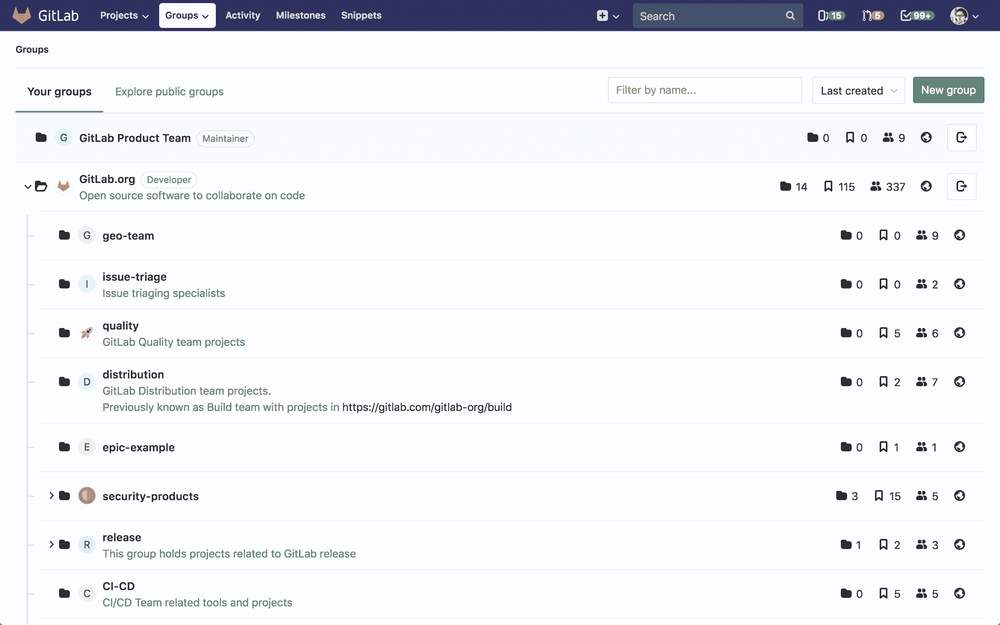](img/groups.png)

" **组织"**页面显示：

*   选择**您的组织**后， 将会显示**您**所属的全部组织（包括子组织）
*   选中" **浏览组织"**时将显示所有公开的组织列表

" **组织"**页面上的每个组都列出了：

*   它有多少个子组
*   它包含多少个项目
*   该组织有多少个成员，注意这里面不包括从父组织继承的成员
*   如果您具有足够的权限，还将显示组织设置的按钮
*   如果您是成员，也会看到退出该组的按钮

## 组织用户示例

您可以出于多种原因创建组织，例如：

*   通过在同一[名称空间](#namespaces)下组织相关项目并将成员添加到顶级组，可以以较少的步骤授予对多个项目和多个团队成员的访问权限。
*   通过创建小组并包括适当的成员，可以轻松地`@mention`所有团队中的问题并合并请求。

例如，您可以为公司成员创建一个[组织](subgroups/index.html) ，并为每个单独的团队创建一个[子组织](subgroups/index.html). 假设您创建了一个名为`company-team` ，并且在该组中为各个团队`backend-team` ， `frontend-team`和`production-team`创建了子组。

*   从问题开始新的实现时，请添加评论： *" `@company-team` ，让我们开始吧！* *`@company-team/backend-team`您很高兴！"*
*   当您的后端团队需要前端提供帮助时，他们会添加一条评论： *" `@company-team/frontend-team`您能在这里帮助我们吗？"*
*   前端团队完成实施后，他们会评论： *" `@company-team/backend-team` ，它已经完成！* *让我们将其推送到`@company-team/production-team` ！*

## 命名空间

在 CODEChina 中，命名空间将会是用户名称、组织名称或子组名的唯一名称。

*   `https://codechina.csdn.net/username`
*   `https://codechina.csdn.net/groupname`
*   `https://codechina.csdn.net/groupname/subgroup_name`

例如，假设有一个名为 Miykael 的用户：

1.  Miykael 在 CODEChina 上使用用户名`Miykael`创建了一个帐户； 他们的个人资料将在`https://codechina.csdn.net/miykael`下访问
2.  Miykael 为他们的团队创建了一个组织，名称为`csdn-team` ； 该组织及其项目将在`https://codechina.csdn.net/csdn-team`下访问
3.  CSDN 创建了一个名为`coding`的子组织 ; 该子组织及其项目将在`https://codechina.csdn.net/csdn-team/coding`下访问

通过这样做：

*   任何团队成员都使用`@miykael`提及 Miykael
*   CSDN通过`@csdn-team`提及了团队中的每个人
*   CSDN只提及`@csdn-team/coding`

> 注：出于系统安全以及知识产权、商标保护等因素，我们预留了一部分namespace，如果您的用户名与预留这部分namespace有冲突，系统将会自动对您在CODEChina中的namespace进行调整。

## 组织内的Issue及合并请求

Issue及合并请求是项目的一部分。对于组织，您可以在单个列表视图中查看所有[Issue](../project/issues/index.html#issues-list)，也可以查看组织中所有项目的[请求合并](../project/merge_requests/reviewing_and_managing_merge_requests.html#view-merge-requests-for-all-projects-in-a-group)。

### 批量编辑Issue及合并请求

有关详细信息，请参考[批量编辑Issue及合并请求](../group/bulk_editing/index.html) 。

## 新建一个组织

> 有关不允许用作组名的单词列表，请参见[保留名称](../reserved_names.html) .

通过以下方式，您可以创建一个新的组织：

*   在顶部菜单中，依次单击" **组织"**和" **您的组织"** ，然后单击绿色按钮" **新建组织"** 

    [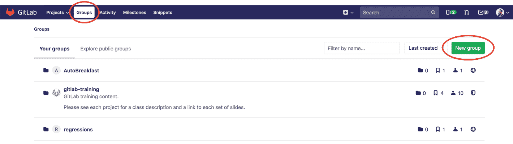](img/new_group_from_groups.png)

*   或者，在顶部菜单中，展开`+`号并选择**新建组织** 

    [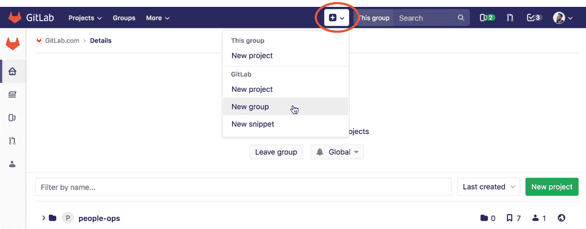](img/new_group_from_other_pages.png)

添加以下信息：

[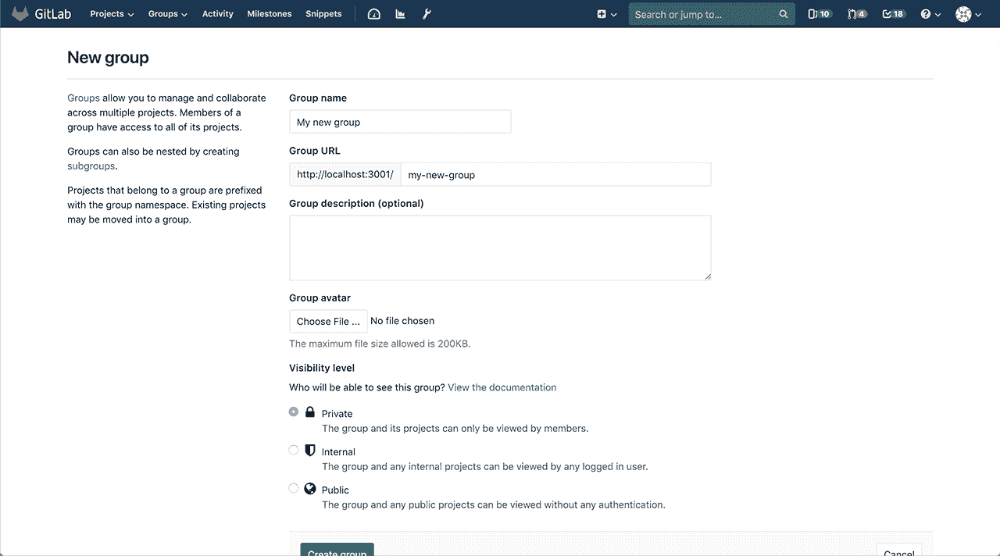](img/create_new_group_info.png)

1.  **组织名称**将自动填充 URL（自动填充不支持中文的组织名称）。（可选）您可以修改它，这是在组视图中显示的名称，该名称只能包含：
    *   字母数字字符
    *   中文
    *   下划线
    *   连接符`-`和点
    *   空格
2.  **组 URL**是将托管项目的名称空间. 该网址只能包含：
    *   字母数字字符
    *   下划线
    *   连接符`-`和点（不能以连接符`-`开头或以点结尾）
3.  （可选）可以为新建的组织添加一段简单介绍，以便其他用户了解该组织
4.  （可选）可以为新建的组织上传一个头像
5.  选择新建的组织 [是否公开可见](../../public_access/public_access.html)

## 为组织添加一个用户

将多个项目放在一个组织中的好处是，您可以通过一个操作就授予某个用户访问该组织中所有项目的权限。

在**组织设置-组织成员设置**中将成员添加到组织，可以通过用户名或者注册邮箱来添加组织成员。

[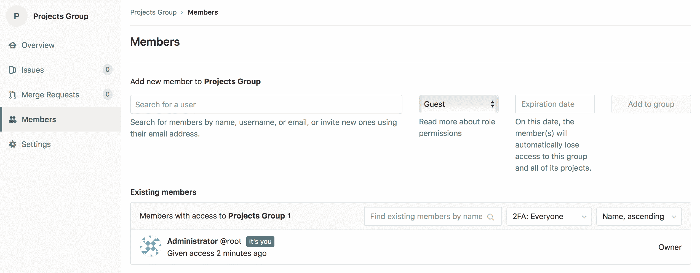](img/add_new_members.png)

选择[权限级别](../permissions.html#permissions) ，然后添加新成员。您还可以设置该用户的到期日期。

假设一个有两个项目的组织：

*   在**组织设置-组织成员设置**页面上，可以将新用户添加到组织中；
*   当将新用户设置为组织的**开发人员**成员时，他们将获得**开发人员**对该组内**所有项目的**访问权限。

如果要提高特定项目的现有用户的访问权限，请将其作为新成员再次添加到特定项目中，并为其添加相应的项目成员角色。

## 申请加入组织

作为组织所有者，您可以启用或禁用非组织成员请求访问组织的功能。该功能可以通过再**组织设置-常规设置-权限，LFS，2FS**中单击**允许用户请求访问(如果可见性是公开或内部的)**进行开启，该功能默认为启用状态。

如果组织启用了该设置，则非组织成员用户可以请求成为组织的成员。在您要加入的组织页中，单击组织名称后面的**申请权限**按钮即可。

[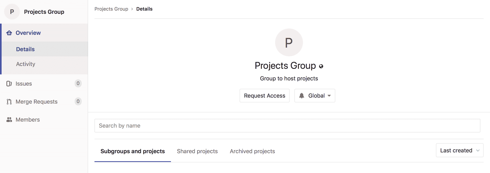](img/request_access_button.png)

申请访问权限后：

*   通过电子邮件将您的申请告知给组织的所有者（电子邮件将发送给最近活跃的组织所有者）
*   任何组织所有者都可以在组组织成员设置页面上批准或拒绝您的申请

[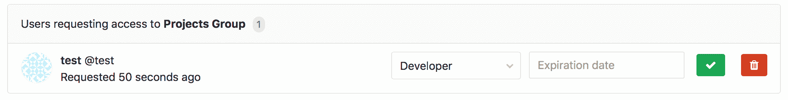](img/access_requests_management.png)

如果您在申请权限被批准之前改变了主意，只需单击" **撤回访问请求"**按钮即可。

[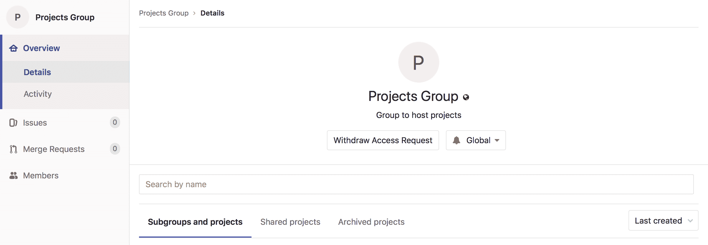](img/withdraw_access_request_button.png)

## 变更组织的所有者

组织的所有关系是指至少有一个组织成员拥有组织的 [所有者权限](../permissions.html#group-members-permissions)，一个组织至少需要一名所有者。

只有拥有一个所有者的组织可以变更组织的所有者。 可以通过以下方式变更组织唯一所有者：

1.  前往组织的 **组织设置-组织成员设置**选项卡；
2.  赋予其他成员**所有者**权限；
3.  让新的所有者删除您的**所有者**权限。

## 移除组织成员

只有[拥有所有者](../permissions.html#group-members-permissions)权限的[用户](../permissions.html#group-members-permissions)才能管理组织成员。

如果要移除的成员在该组中具有直接成员资格，则可以从该组织中移除该成员； 如果成员资格是从父组继承的，则该成员只能从父组中进行移除。

移除成员时，您可以决定是否取消已经指派给该成员的 Issue 及合并请求。

*   **取消分配给已移除的成员的 Issue及合并请求**可以将已经分配给当前要移除用户的 Issue 及合并请求重新进行分配
*   **保留Issue和合并请求的分配**可能对于接受公开贡献的组织很有帮助，用户可以不必是组织成员就可以为 Issue 及合并请求做出贡献

可以通过以下操作将成员从组织中移除：

1.  在一个组织中，进入 **组织设置-组织成员设置** 
2.  找到要移除的成员，并点击**移除**按钮，这时会弹出 **移除成员** 的弹窗
3.  （可选）选中 **取消分配给已移除的成员的 Issue及合并请求** 的复选框
4.  点击**移除成员**按钮

## 变更组织的默认保护分支

默认情况下，每个组织都会继承全局级别的分支保护。

您可以通过以下操作为特定组织变更此项设置：

1.  打开组织的 **组织设置-常规设置**页面
2.  展开 **权限，LFS，2FA**部分
3.  在**默认分支保护**下拉列表中选择所需的选项
4.  点击 **保存修改**

## 在组织中新建项目

有两种方法可以在组织中新建项目：

*   选择一个组，单击**新建项目**按钮 。 然后，您可以继续[创建您的项目](../../basics/create-project.html) .

    [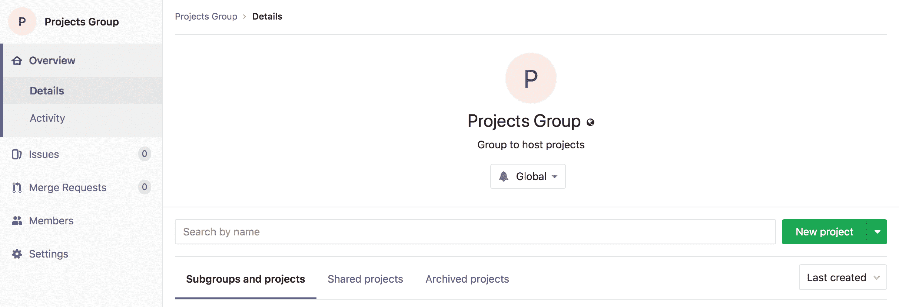](img/create_new_project_from_group.png)

*   在创建项目时，从下拉菜单中选择已经创建的组名称空间

    [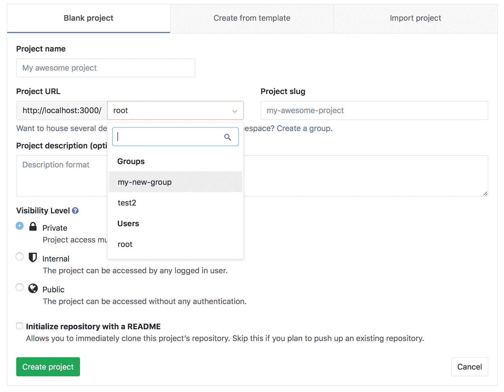](img/select_group_dropdown.png)

### 项目创建权限

默认情况下， [开发人员和维护人员](../permissions.html#group-members-permissions)可以在一个组下创建项目。

可以通过以下操作为特定组更改此项设置：

1.  进入组织的**组织设置>常规设置**页面
2.  展开 **权限，LFS，2FA**部分
3.  在 **允许创建项目**下拉列表中选择所需的选项
4.  点击 **保存修改**

## 查看组织详情

组织的 **详细信息**页面包含以下内容：

*   组织的基本信息和介绍
*   组织的项目
*   组织已存档的项目
*   组织的成员

## 将项目移到组织中

了解如何[将项目转移到组织中](../project/settings/index.html#transferring-an-existing-project-into-another-namespace) .

## 与组织共享一个项目

您可以[与组织共享您的项目](../project/members/share_project_with_groups.html)，并向所有组织成员立即授予对该项目的访问权限。

或者，您可以[锁定共享与组功能](#share-with-group-lock) .

## 与组织共享另一个组织

与[与组织共享项目](#sharing-a-project-with-a-group)类似，您可以与一个组织共享另一个组织，以使组织成员可以直接访问共享的组织（注：这对于继承的成员无效）。

要将给定的组（例如"前端"）与另一个组（例如"工程"）共享：

1.  进入到"前端"组织页面，然后进入**组织设置-组织成员设置**页面
2.  单击 **邀请组织** 按钮
3.  选择您要共享的组织"工程"，并设置访问权限
4.  点击 **邀请**

"工程"的所有成员将被添加到"前端"组织中。

## 转移组织

您可以通过以下方式转移组织：

*   将子组织转移到新的父组织
*   通过将顶级组织转移到所需的组织，并将其转换为子组织
*   通过将子组织转移到顶级组织，可以将一个子组织转换为组织

转移组织时，请注意：

*   更改组织的父组织可能会产生一些副作用，具体的请参阅[更改存储库路径时的重定向](../project/index.html#redirects-when-changing-repository-paths) ；
*   您只能将组织/子组织转移到您管理的组织/子组织中；
*   您必须手动更新本地存储库以指向新位置；
*   如果将要转移的父组织的公开可见性设置低于当前父组织，那么待转移组织机器项目的公开可见性将会与即将要转移到的父组织保持一致；
*   转移组织时，只有组织直接成员会被转移，从之前父组织集成的成员不会被转移。如果待转移组织的所有者是继承的身份成员，则该组织转移过去后将不会设有所有者，转移组的用户将会自动成为该组的所有者。

## 组织设置

创建组织后，在组织详情页您可以进入**组织设置**来对组织进行设置及管理：

[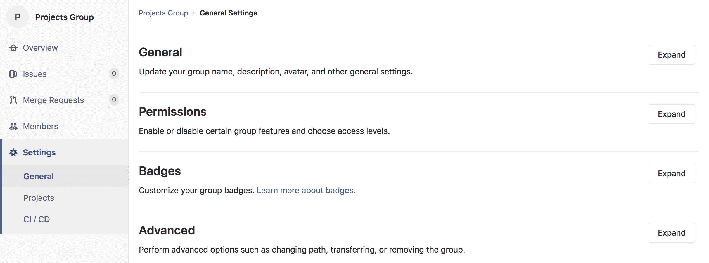](img/group_settings.png)

### 常规设置

除了编辑您在[创建组织](#新建一个组织)时预先设置的内容外，您还可以对该组织的其他内容进行设置。

#### 变更组织的路径

变更组织的路径也可能会产生一些副作用，具体的请参考[重定向的行为](../project/index.html#redirects-when-changing-repository-paths) 。

如果您要腾出路径，以便其他组织或用户可以使用该路径，由于名称和路径都必须是唯一的，因此您在变更路径的同时也可能需要重命名该组织。

您可以通过以下操作更改组织的路径：

1.  进入到组织的**组织设置>常规设置**页面
2.  展开**高级**部分
3.  在 **更改组织路径**下输入新的路径
4.  点击 **变更组织路径**

> **注意：**如果命名空间包含带有[Container Registry](../packages/container_registry/index.html)标记的项目，则无法重命名该空间，因为该项目无法移动。
> 
> **提示：**如果要保留对原始名称空间的所有权并保护 URL 重定向，我们建议您新建一个群组并向其转移项目，而无需更改组织的路径或重命名用户名。

### Remove a group

删除组及其内容：

1.  导航到您小组的 **设置>常规**页面.
2.  展开**路径，传输，删除**部分.
3.  在"删除组"部分中，单击" **删除组"**按钮.
4.  根据要求确认操作.

此操作要么：

*   删除组，并且将后台作业排队以删除该组中的所有项目.
*   从[GitLab 12.8 开始](https://gitlab.com/gitlab-org/gitlab/-/issues/33257) ，在[Premium 或 Silver](https://about.gitlab.com/pricing/premium/)或更高级别上，将一个组标记为删除. 默认情况下，删除将在 7 天后进行，但是可以在[实例设置中](../admin_area/settings/visibility_and_access_controls.html#default-deletion-adjourned-period-premium-only)进行更改.

### Restore a group

在 GitLab 12.8 中[引入](https://gitlab.com/gitlab-org/gitlab/-/issues/33257) .

要还原标记为删除的组：

1.  导航到您小组的 **设置>常规**页面.
2.  展开**路径，传输，删除**部分.
3.  在"还原组"部分中，单击" **还原组"**按钮.

#### Enforce 2FA to group members

通过对所有组成员[强制执行两因素身份验证（2FA）](../../security/two_factor_authentication.html#enforcing-2fa-for-all-users-in-a-group) ，将安全层添加到您的组中.

#### Share with group lock

防止一个组中[的项目与另一个组共享项目，](../project/members/share_project_with_groups.html)以便对项目访问进行更严格的控制.

例如，假设您有两个不同的团队（A 组和 B 组）在一个项目中一起工作，并且要继承该组成员身份，您可以在 A 组和 B 组之间共享项目. **使用组锁共享**可以防止其中的任何项目该群组不会与其他群组共享，从而确保只有合适的群组成员才能访问这些项目.

要启用此功能，请导航至组设置页面. 选择" **使用组锁定共享"**并**保存组** .

#### Member Lock

成员锁定使组所有者可以阻止组中所有项目的任何新项目成员资格，从而可以更严格地控​​制项目成员资格.

例如，如果要为" [审核事件"](../../administration/audit_events.html)锁定组，请启用"成员锁定"以确保在该审核期间不能修改项目成员身份.

要启用此功能：

1.  导航到组的**"设置">"常规"**页面.
2.  展开" **权限，LFS，2FA"**部分，然后选择" **成员锁"** .
3.  Click **保存更改**.

[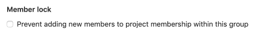](img/member_lock.png)

这将对以前有权操作项目成员资格的所有用户禁用该选项，因此无法添加新用户. 此外，将无法通过 API 向项目添加新用户的任何请求.

#### IP access restriction

版本历史

*   在[GitLab Ultimate 和 Gold](https://about.gitlab.com/pricing/) 12.0 中[引入](https://gitlab.com/gitlab-org/gitlab/-/issues/1985) .
*   在 13.1 中[移至](https://gitlab.com/gitlab-org/gitlab/-/issues/215410) [GitLab Premium 和 Silver](https://about.gitlab.com/pricing/) .

为了确保只有组织内的人员可以访问特定资源，您可以选择通过 IP 地址限制对组及其基础项目，问题等的访问. 这可以帮助确保特定内容不会离开场所，同时又不会阻止对整个实例的访问.

使用 CIDR 表示法将一个或多个允许的 IP 子网添加到组设置中，并且来自其他 IP 地址的任何人将无法访问受限制的内容.

目前限制适用于：

*   UI.
*   [从 GitLab 12.3 开始](https://gitlab.com/gitlab-org/gitlab/-/issues/12874) ，可以访问 API.
*   [从 GitLab 12.4 开始](https://gitlab.com/gitlab-org/gitlab/-/issues/32113) ，Git 通过 SSH 进行操作.

为了避免意外锁定，管理员和组所有者可以访问组，而不受 IP 限制.

要启用此功能：

1.  导航到组的**"设置">"常规"**页面.
2.  展开" **权限，LFS，2FA"**部分，然后在" **允许访问以下 IP 地址"**字段中输入 IP 地址范围.
3.  Click **保存更改**.

#### Allowed domain restriction

版本历史

*   在[GitLab Premium 和 Silver](https://about.gitlab.com/pricing/) 12.2 中[引入](https://gitlab.com/gitlab-org/gitlab/-/issues/7297) .
*   支持指定 GitLab 13.1 中[引入的](https://gitlab.com/gitlab-org/gitlab/-/issues/33143)多个电子邮件域

通过仅将具有特定域中电子邮件地址的用户添加到组中，可以限制对组的访问.

添加您要允许的电子邮件域，并且不允许来自不同域的电子邮件用户添加到该组.

某些域不能被限制. 这些是最受欢迎的公共电子邮件域，例如：

*   `gmail.com`
*   `yahoo.com`
*   `hotmail.com`
*   `aol.com`
*   `msn.com`
*   `hotmail.co.uk`
*   `hotmail.fr`
*   `live.com`
*   `outlook.com`
*   `icloud.com`

要启用此功能：

1.  导航到组的**"设置">"常规"**页面.
2.  展开" **权限，LFS，2FA"**部分，然后在" **通过电子邮件限制成员身份"**字段中输入域名.
3.  Click **保存更改**.

此后，将对所有添加到组中的新用户启用域检查.

#### Group file templates

组文件模板使您可以与组中的每个项目共享一组通用文件类型的模板. 它类似于[实例模板存储库](../admin_area/settings/instance_template_repository.html)功能，所选项目应遵循该页面上记录的相同命名约定.

您只能在组中选择项目作为模板源. 这包括与该组共享的项目，但**不包括**正在配置的组的子组或父组中的项目.

您可以为子组和直接父组配置此功能. 子组中的项目将有权访问该子组以及任何直接父组的模板.

[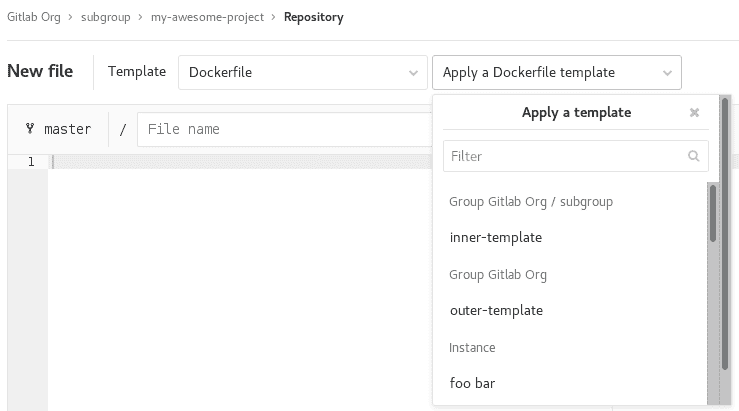](img/group_file_template_dropdown.png)

要启用此功能，请导航至组设置页面，展开" **模板"**部分，选择一个项目作为模板存储库，然后选择" **保存组"** .

[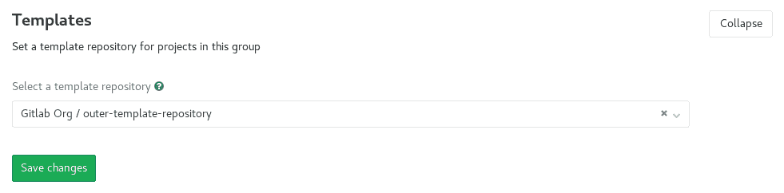](img/group_file_template_settings.png)

#### Group-level project templates

通过将组设置为模板源，在组级别定义项目模板. [了解有关组级项目模板的更多信息](custom_project_templates.html) .

#### Disabling email notifications

在 GitLab 12.2 中[引入](https://gitlab.com/gitlab-org/gitlab/-/issues/23585) .

您可以禁用与该组相关的所有电子邮件通知，其中包括其子组和项目.

要启用此功能：

1.  导航到组的**"设置">"常规"**页面.
2.  展开**权限，LFS，2FA**部分，然后选择**禁用电子邮件通知** .
3.  Click **保存更改**.

#### Disabling group mentions

在 GitLab 12.6 中[引入](https://gitlab.com/gitlab-org/gitlab/-/issues/21301) .

您可以防止将用户添加到对话中，并且在任何人提及这些用户所属的组时通知他们.

自动完成下拉列表中会相应地显示提及被禁用的组.

这对于具有大量用户的组特别有用.

要启用此功能：

1.  导航到组的**"设置">"常规"**页面.
2.  展开" **权限"，" LFS，2FA"**部分，然后选择" **禁用组提及"** .
3.  Click **保存更改**.

#### Enabling delayed Project removal

在 GitLab 13.2 中[引入](https://gitlab.com/gitlab-org/gitlab/-/issues/220382) .

默认情况下，组中的项目会立即删除. （可选）在[Premium 或 Silver](https://about.gitlab.com/pricing/)或更高级别上，您可以将组内的项目配置为在延迟间隔后删除.

在此间隔期间，项目将处于只读状态，并且可以根据需要还原. 间隔时间默认为 7 天，可以由管理员在[实例设置中](../admin_area/settings/visibility_and_access_controls.html#default-deletion-adjourned-period-premium-only)进行修改.

要启用延迟删除项目：

1.  导航到组的**"设置">"常规"**页面.
2.  展开" **权限"，" LFS，2FA"**部分，然后选中" **启用延迟的项目删除"** .
3.  Click **保存更改**.

### Advanced settings

*   **项目** ：查看该组中的所有项目，将成员添加到每个项目，访问每个项目的设置，以及删除任何项目，所有操作均在同一屏幕上进行.
*   **Webhooks** ：为您的组配置[webhooks](../project/integrations/webhooks.html) .
*   **Kubernetes 集群集成** ：将您的 GitLab 组与[Kubernetes 集群连接](clusters/index.html) .
*   **审核事件** ：查看该组的[审核事件](../../administration/audit_events.html) .
*   **管道配额** ：跟踪组的[管道配额](../admin_area/settings/continuous_integration.html) .

#### Group push rules

[Introduced](https://gitlab.com/gitlab-org/gitlab/-/issues/34370) in [GitLab Starter](https://about.gitlab.com/pricing/) 12.8.

组推送规则允许组维护者为特定组内的新创建项目设置[推送规则](../../push_rules/push_rules.html) .

要为组配置推送规则，请导航至 在小组的侧边栏上.

设置后，新的子组将根据以下任一条件为其设置推送规则：

*   定义了推送规则的最接近的父组.
*   如果没有父组定义推送规则，则在实例级别设置推送规则.